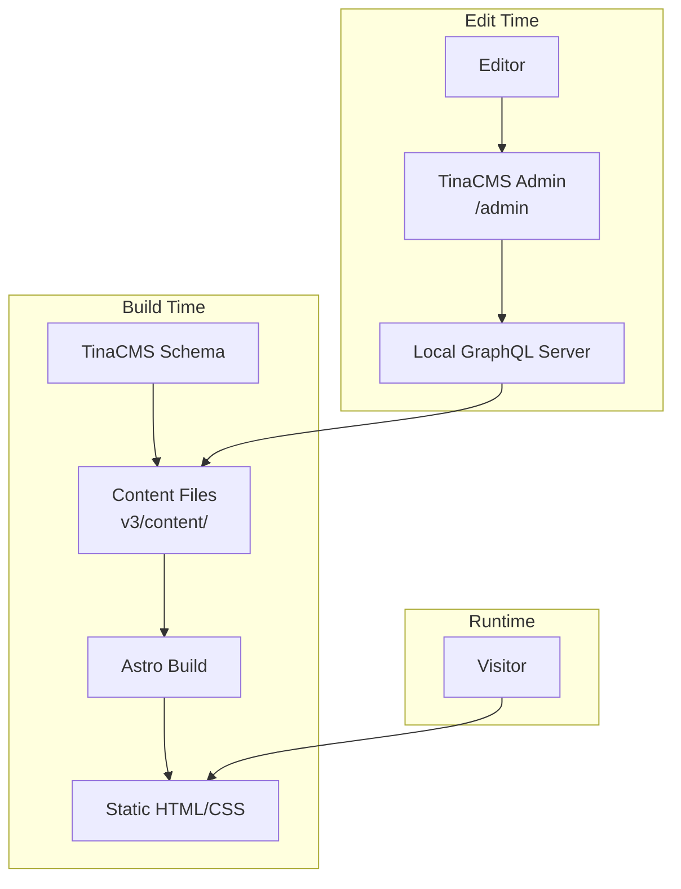

# Design Document: V3 Astro Portfolio

## Overview

The v3 portfolio is a static site built with Astro.js and TinaCMS, located in the `v3/` directory. Astro generates fully static HTML at build time, delivering excellent SEO and performance. TinaCMS provides a Git-backed visual editing interface, storing content as Markdown files in the repository. The site uses Tailwind CSS for styling and TypeScript throughout.

Key design decisions:

- **Astro over SvelteKit**: Astro's static-first approach with zero JS by default is ideal for a content portfolio site. No client-side hydration needed for content pages.
- **TinaCMS over Contentful**: Git-backed content means no external API dependency, simpler deployment, and the editor can work locally. Content lives in the repo as Markdown/JSON files.
- **Tailwind CSS**: Consistent with v2, provides utility-first responsive design.
- **GSAP for animations**: Page transitions and content reveal animations use GSAP, consistent with v2. GSAP is loaded as a client-side script via Astro's `<script>` tags (not an island/framework component). This adds a small JS payload but provides smooth, professional animations.

## Architecture



The architecture has three modes:

1. **Build time**: Astro reads Markdown content files, applies layouts and components, outputs static HTML.
2. **Edit time**: TinaCMS runs a local GraphQL server, provides a visual editor at `/admin`, and writes changes back to content files.
3. **Runtime**: Visitors receive pre-built static HTML. A small client-side GSAP script handles page transition animations and content reveal effects.

## Components and Interfaces

### Project Structure

```
v3/
├── astro.config.mjs          # Astro config (sitemap, tailwind integrations)
├── tina/
│   └── config.ts             # TinaCMS schema and collections
├── content/
│   ├── fi/                       # Finnish content (default locale)
│   │   ├── home/
│   │   │   └── index.md          # Home page content
│   │   ├── works/
│   │   │   ├── ceramic.md        # Keramiikka gallery
│   │   │   ├── installation.md   # Installaatio gallery
│   │   │   ├── sculpture.md      # Veistos gallery
│   │   │   └── customer.md       # Asiakastyö gallery
│   │   ├── cv/
│   │   │   └── index.md          # CV sections and entries
│   │   └── contact/
│   │       └── index.md          # Contact page content
├── src/
│   ├── layouts/
│   │   └── BaseLayout.astro  # Shared layout (nav, footer, meta)
│   ├── components/
│   │   ├── Navigation.astro  # Desktop + mobile nav
│   │   ├── Footer.astro      # Site footer
│   │   ├── SEO.astro         # Meta/OG tag component
│   │   └── Gallery.astro     # Image gallery grid
│   └── pages/
│       ├── index.astro       # Home page
│       ├── works/
│       │   └── [slug].astro  # Dynamic works pages
│       ├── cv.astro          # CV page
│       └── contact.astro     # Contact page
├── public/
│   ├── admin/                # TinaCMS admin build output
│   ├── images/               # Uploaded images (managed by TinaCMS)
│   ├── favicon.ico
│   └── robots.txt
├── tailwind.config.mjs
├── tsconfig.json
└── package.json
```

### Component Interfaces

#### BaseLayout.astro

```typescript
// Props
interface Props {
  title: string // Page title for <title> tag
  description: string // Meta description
  locale?: Locale // defaults to DEFAULT_LOCALE ('fi')
}
```

Wraps every page. Sets `<html lang={locale}>` on the document element. Renders `<SEO>`, `<Navigation>`, `<main><slot /></main>`, and `<Footer>`. Includes a client-side `<script>` that initializes GSAP for:

- **Page transitions**: Fade/slide animations on navigation using Astro's View Transitions API (`astro:before-swap` and `astro:after-swap` lifecycle events).
- **Content reveals**: Elements with a `.reveal` class animate in (fade + slight upward slide) when they enter the viewport, using GSAP with IntersectionObserver.
- **Footer fade-in**: Footer animates in on page load, consistent with v2 behavior.

Astro's View Transitions are enabled via `<ViewTransitions />` in the layout head, providing smooth client-side navigation between static pages.

#### Navigation.astro

No props. Reads the current URL from `Astro.url.pathname` to highlight the active link. Renders:

- Desktop: horizontal link list (hidden below 768px)
- Mobile: hamburger icon + full-screen overlay (hidden at 768px+)

Mobile menu toggle uses a small inline `<script>` (Astro island-free approach with vanilla JS for the toggle).

#### SEO.astro

```typescript
interface Props {
  title: string
  description: string
  ogType?: string // defaults to "website"
}
```

Renders `<title>`, `<meta name="description">`, and Open Graph tags into `<head>`.

#### Gallery.astro

```typescript
interface Props {
  items: Array<{
    image: string // path to image
    title: string
  }>
}
```

Renders a responsive CSS grid: single column on mobile, multi-column (2-3 cols) on desktop.

#### Footer.astro

No props. Renders copyright with dynamic year, artist name, and credit link.

### Page Data Flow

Each page reads content from Markdown files using TinaCMS's generated client:

```typescript
// Example: works/[slug].astro
import { client } from "../../tina/__generated__/client"

const { slug } = Astro.params
const response = await client.queries.works({ relativePath: `${slug}.md` })
const data = response.data.works
```

For static generation, `getStaticPaths()` returns the four work category slugs:

```typescript
export function getStaticPaths() {
  return [
    { params: { slug: "ceramic" } },
    { params: { slug: "installation" } },
    { params: { slug: "sculpture" } },
    { params: { slug: "customer" } },
  ]
}
```

## Data Models

### TinaCMS Collections Schema

The TinaCMS config (`tina/config.ts`) defines four collections:

#### Home Collection

```typescript
{
  name: 'home',
  label: 'Etusivu',
  path: 'content/fi/home',
  format: 'md',
  fields: [
    { name: 'title', label: 'Otsikko', type: 'string', required: true, isTitle: true },
    { name: 'description', label: 'SEO-kuvaus', type: 'string' },
    { name: 'body', label: 'Sisältö', type: 'rich-text', isBody: true },
  ],
}
```

#### Works Collection

```typescript
{
  name: 'works',
  label: 'Teokset',
  path: 'content/fi/works',
  format: 'md',
  fields: [
    { name: 'title', label: 'Otsikko', type: 'string', required: true, isTitle: true },
    { name: 'description', label: 'SEO-kuvaus', type: 'string' },
    { name: 'slug', label: 'URL-tunnus', type: 'string', required: true },
    {
      name: 'gallery',
      label: 'Galleria',
      type: 'object',
      list: true,
      fields: [
        { name: 'image', label: 'Kuva', type: 'image' },
        { name: 'title', label: 'Teoksen nimi', type: 'string' },
      ],
    },
  ],
}
```

#### CV Collection

```typescript
{
  name: 'cv',
  label: 'CV',
  path: 'content/fi/cv',
  format: 'md',
  fields: [
    { name: 'title', label: 'Otsikko', type: 'string', required: true, isTitle: true },
    { name: 'description', label: 'SEO-kuvaus', type: 'string' },
    {
      name: 'sections',
      label: 'Osiot',
      type: 'object',
      list: true,
      fields: [
        { name: 'sectionTitle', label: 'Osion otsikko', type: 'string', required: true },
        {
          name: 'entries',
          label: 'Merkinnät',
          type: 'object',
          list: true,
          fields: [
            { name: 'date', label: 'Päivämäärä', type: 'string' },
            { name: 'content', label: 'Sisältö', type: 'string', required: true },
          ],
        },
      ],
    },
  ],
}
```

#### Contact Collection

```typescript
{
  name: 'contact',
  label: 'Yhteystiedot',
  path: 'content/fi/contact',
  format: 'md',
  fields: [
    { name: 'title', label: 'Otsikko', type: 'string', required: true, isTitle: true },
    { name: 'description', label: 'SEO-kuvaus', type: 'string' },
    { name: 'body', label: 'Sisältö', type: 'rich-text', isBody: true },
  ],
}
```

### Content File Examples

#### Works Markdown (content/fi/works/ceramic.md)

```markdown
---
title: Keramiikka
description: Reetta Lipposen keramiikkatyöt
slug: ceramic
gallery:
  - image: /images/ceramic-1.jpg
    title: Teos 1
  - image: /images/ceramic-2.jpg
    title: Teos 2
---
```

#### CV Markdown (content/fi/cv/index.md)

```markdown
---
title: CV
description: Reetta Lipponen - CV
sections:
  - sectionTitle: Näyttelyt
    entries:
      - date: "2024"
        content: Näyttely X, Galleria Y, Lappeenranta
      - date: "2023"
        content: Näyttely Z, Museo W, Helsinki
  - sectionTitle: Koulutus
    entries:
      - date: "2020"
        content: Taiteen maisteri, Aalto-yliopisto
---
```

### Navigation and UI Strings

Navigation items and UI strings are stored in a translatable constants file, separate from CMS content:

```typescript
// src/lib/i18n.ts
export const DEFAULT_LOCALE = "fi" as const
export type Locale = "fi" | "en"

export const UI_STRINGS: Record<
  Locale,
  {
    navigation: Array<{ label: string; href: string }>
    footer: { credit: string }
  }
> = {
  fi: {
    navigation: [
      { label: "Etusivu", href: "/" },
      { label: "Keramiikka", href: "/works/ceramic" },
      { label: "Installaatio", href: "/works/installation" },
      { label: "Veistos", href: "/works/sculpture" },
      { label: "Asiakastyö", href: "/works/customer" },
      { label: "CV", href: "/cv" },
      { label: "Yhteystiedot", href: "/contact" },
    ],
    footer: { credit: "Website by" },
  },
  en: {
    navigation: [
      { label: "Home", href: "/" },
      { label: "Ceramics", href: "/works/ceramic" },
      { label: "Installation", href: "/works/installation" },
      { label: "Sculpture", href: "/works/sculpture" },
      { label: "Custom Work", href: "/works/customer" },
      { label: "CV", href: "/cv" },
      { label: "Contact", href: "/contact" },
    ],
    footer: { credit: "Website by" },
  },
}

export const MOBILE_BREAKPOINT = 768
```

For now, the site uses `DEFAULT_LOCALE` ('fi') everywhere. When English is added later, routes can be prefixed (e.g., `/en/works/ceramic`) and the locale resolved from the URL.

## Correctness Properties

_A property is a characteristic or behavior that should hold true across all valid executions of a system — essentially, a formal statement about what the system should do. Properties serve as the bridge between human-readable specifications and machine-verifiable correctness guarantees._

The following properties were derived from the acceptance criteria prework analysis. After reflection, redundant properties (e.g., multiple SEO-related criteria across requirements 3.3, 6.3, 7.3, 7.4) were consolidated, and related criteria at different granularity levels (e.g., CV sections and entries) were combined.

### Property 1: SEO meta tags are complete for all pages

_For any_ page with a title and description, the rendered HTML SHALL contain a `<title>` tag matching the title, a `<meta name="description">` tag matching the description, and Open Graph tags (`og:title`, `og:description`, `og:type`).

**Validates: Requirements 3.3, 6.3, 7.3, 7.4**

### Property 2: Layout structure is consistent across all pages

_For any_ page in the site, the rendered HTML SHALL contain a `<nav>` element, a `<main>` element, and a `<footer>` element.

**Validates: Requirements 2.1**

### Property 3: Active navigation link matches current page

_For any_ page URL that corresponds to a navigation item, the navigation link for that URL SHALL have an `aria-current="page"` attribute, and no other navigation link SHALL have that attribute.

**Validates: Requirements 2.3**

### Property 4: Works page renders all gallery items

_For any_ works content with a title and a list of gallery items, the rendered Works_Page SHALL contain the category title, and for each gallery item, the page SHALL contain an `` element with the item's image source and the item's title text.

**Validates: Requirements 4.2, 4.6**

### Property 5: CV page renders all sections and entries

_For any_ CV content with a list of sections, the rendered CV page SHALL contain each section's title. For each section, every entry's content text SHALL appear in the output, and if an entry has a date, that date SHALL also appear.

**Validates: Requirements 5.1, 5.2**

### Property 6: Sitemap contains all site URLs

_For any_ set of defined routes in the site, the generated `sitemap.xml` SHALL contain a `<url>` entry for each route.

**Validates: Requirements 7.1**

### Property 7: Static build produces HTML for all routes

_For any_ defined route in the site, the build output SHALL contain a corresponding HTML file.

**Validates: Requirements 1.3**

## Error Handling

| Scenario                        | Behavior                                                                                                                                                        |
| ------------------------------- | --------------------------------------------------------------------------------------------------------------------------------------------------------------- |
| Missing content file for a page | Astro build fails with a clear error message indicating which content file is missing. This is caught at build time, not runtime.                               |
| Invalid frontmatter in Markdown | TinaCMS schema validation rejects invalid data in the editor. If manually edited, Astro build fails with a parse error.                                         |
| Missing image in gallery item   | The `` tag renders with a broken image. The Gallery component should use an `alt` attribute with the title as fallback text.                               |
| TinaCMS admin not accessible    | The `/admin` route serves the TinaCMS SPA. If TinaCMS build output is missing from `public/admin/`, a 404 is returned. Resolved by running `npx tinacms build`. |
| Unknown works slug in URL       | `getStaticPaths` only generates pages for the four known slugs. Any other slug returns a 404 at build time (no page generated).                                 |

Since the site is fully static, most errors are caught at build time rather than runtime. The primary error surface is content validation, which TinaCMS handles through its schema.

## Testing Strategy

### Unit Tests

Unit tests verify specific examples and edge cases:

- Navigation component renders all expected links
- Footer displays current year and artist name
- SEO component renders correct meta tags for given inputs
- Gallery component handles empty gallery array gracefully
- CV page handles sections with entries that have no date

### Property-Based Tests

Property-based tests verify universal properties across generated inputs. Use `fast-check` as the property-based testing library with TypeScript.

Each property test:

- Runs a minimum of 100 iterations
- References its design document property with a tag comment
- Uses `fast-check` arbitraries to generate random valid content data

Property tests focus on data transformation correctness:

- Generating random page metadata and verifying SEO output (Property 1)
- Generating random gallery data and verifying rendering completeness (Property 4)
- Generating random CV sections/entries and verifying rendering (Property 5)

Properties 2, 3, 6, and 7 are better suited to integration tests that run against the built site output, verifying structural invariants across all pages.

### Test Configuration

- Framework: Vitest (compatible with Astro's Vite-based build)
- Property testing: `fast-check` library
- Minimum 100 iterations per property test
- Tag format: `Feature: v3-astro-portfolio, Property N: <property text>`
